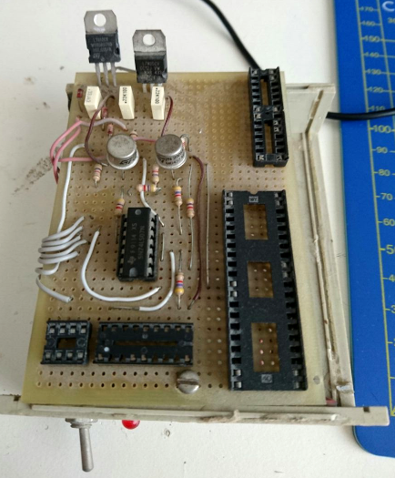
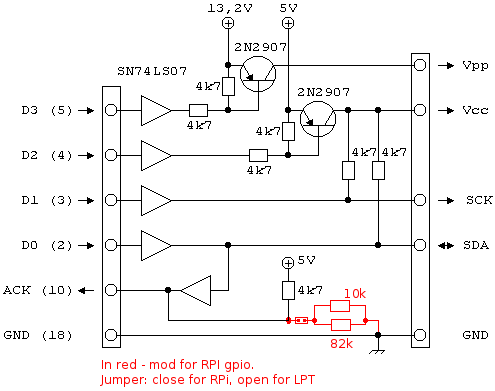
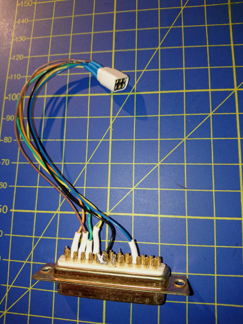

The modified old parallel programmer
======================

So, I resumed my old hardware programmer, I removed some dust from it, and I
checked its conditions..



The hardware programmer was done as per a schematic found over the internet years ago.



The original schematic is in black, while the red stuff has been added by me for the RPi.
Basically the two transistors act as switches to enable/disable the VCC and VPP,
while the IC SN74LS07 is a Open Collector buffer.

I checked on the datasheet of the SN74LS07 whether the 3.3V signals from the RPi were
sufficient to drive it, and it turned out that 2V is the recommended minimum high
level, so it's fine for the RPi.

The open-collector logic and the pullup resistors to VCC make sure that
the PIC is programmed with proper voltage (5V) even if the RPi has 3.3V outputs.

The only problem was about the logic level of the data from the programmer to the
RPi, that has 5V high level. I don't know if the RPi inputs are 5V tolerant, I
think they aren't, and I wanted to go safe, so I decided to modify the circuit.

As you can see, in red, I have added a couple of resistors to lower the 5V signal
to about 3.3V. Maybe there are better solutions, but this was something that I
could readily made with spare parts I had at home :)

The jumper purpose is to eventually disable the resistors if I want to switch back
to 5V signals. If you don't need to keep backward compatibility wrt the parallel port
you can either:
- place a short instead of the jumper
- wire the pullup resistorto the 3.3V from RPi instead of 5V, thus you don't need the
red components.

**NOTE: this means that you will probably FRY you RPi** without the resistors or if
you forget to close the jumper.

In my programmer I used a 7812 regulator to obtain the 13V supply (that is the needed Vpp
for my PICs) from an external supply, and a 7805 to obtain the +5V from the +13V rail.

In order to make the 7812 to ouput about 13V I put a couple of diodes in series to its GND pin.
The external power supply is something around 18V.

You can omit (short) the diodes to achieve 12V or change the 7812 with a 7809 to
achieve 9V, depending by your needs. A LM317, with proper resistors, and a couple of
jumpers, could be a better choice to obtain configurable Vpp.

I have also two leds on the front panel (they are not visible in the pictures) to monitor
the VCC (+5V) and VPP (+13V) states.

Finally I build a simple cable to connect the RPi GPIOs to the DB-25 connector of
my old parallel programmer.



Here is the diagram for the RPi pin I choose

```
                                                     vcc  do  vpp
                                                 gnd g16  g20 g21
+----------------------------------------------------------------+
| 02 04 06 08 10 12 14 16 18 20 22 24 26 28 30 32 34  36  38  40 |
| 01 03 05 07 09 11 13 15 17 19 21 23 25 27 29 31 33  35  37  39 |
+----------------------------------------------------------------+
                                                      g19 g26 gnd
                                                      di  clk
```

The cable wiring diagram is
```
DB25 RPi function
2    38  DO
3    37  CLK
4    26  VCC
5    40  VDD
10   35  DI
18   29  GND
```
NOTE: VCC and VPP are actually VCC nEnable and VPP nEnable control signals.
